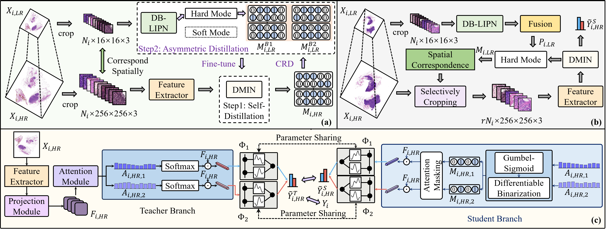

# AHDMIL: Asymmetric Hierarchical Distillation Multi-Instance Learning for Fast and Accurate Whole-Slide Image Classiffcation


This repository is an **extended version** of our previous conference paper published at [CVPR 2025](https://openaccess.thecvf.com/content/CVPR2025/html/Dong_Fast_and_Accurate_Gigapixel_Pathological_Image_Classification_with_Hierarchical_Distillation_CVPR_2025_paper.html).  

The current version includes additional experiments, a redesigned architecture, and deeper analysis.  

If you previously used the CVPR version, we highly encourage switching to this updated version.

## How to use: training & validation & testing scripts
### For the Camelyon16 dataset
```shell
python run.py --pretrain ResNet50_ImageNet --dataset Camelyon16 --gpu_id 1 --fold 10 \
    --label_frac 1.00 --init_type xaiver --model AHDMIL \
    --pretrain_dir experiments/C10/Res50/init_xaiver/wrong_label_rate=0.0/label_frac=1.0/model=v4_degree=12/lr=0.0003_maskratio=0.6/ckpts/ \
    --mask_ratio 0.6 --degree 12 --lwc mbv4t --distill_loss l1 --LIPN_lr 1e-5 --DMIN_lr 1e-5 \
    --num_moe 2 --LIPN_ema 0.2 --attn_ratio 0.4
```

### For the TCGA-NSCLC dataset
```shell
python run.py --pretrain ResNet50_ImageNet --dataset TCGA-NSCLC --gpu_id 1 --fold 10 \
    --label_frac 1.00 --init_type xaiver --model AHDMIL \
    --pretrain_dir experiments/N10/Res50/init_xaiver/wrong_label_rate=0.0/label_frac=1.0/model=v4_degree=16/lr=3e-05_maskratio=0.7/ckpts/ \
    --mask_ratio 0.7 --degree 16 --lwc mbv4t --distill_loss l1 --LIPN_lr 1e-5 --DMIN_lr 1e-5 \
    --num_moe 2 --LIPN_ema 0.0 --attn_ratio 0.1
```

### For the TCGA-BRCA dataset
```shell
python run.py --pretrain ResNet50_ImageNet --dataset TCGA-BRCA --gpu_id 1 --fold 10 \
    --label_frac 1.00 --init_type xaiver --model AHDMIL \
    --pretrain_dir experiments/B10/Res50/init_xaiver/wrong_label_rate=0.0/label_frac=1.0/model=v4_degree=12/lr=0.0003_maskratio=0.7/ckpts/ \
    --mask_ratio 0.7 --degree 12 --lwc mbv4t --distill_loss l1 --LIPN_lr 1e-5 --DMIN_lr 1e-5 \
    --num_moe 2 --LIPN_ema 0.0 --attn_ratio 0.0
```

### For the TCGA-RCC dataset
```shell
python run.py --pretrain ResNet50_ImageNet --dataset TCGA-RCC --gpu_id 1 --fold 10 \
    --label_frac 1.00 --init_type xaiver --model AHDMIL \
    --pretrain_dir experiments/R10/Res50/init_xaiver/wrong_label_rate=0.0/label_frac=1.0/model=v4_degree=12/lr=0.0003_maskratio=0.6/ckpts/ \
    --mask_ratio 0.6 --degree 12 --lwc mbv4t --distill_loss l1 --LIPN_lr 1e-5 --DMIN_lr 1e-5 \
    --num_moe 2 --LIPN_ema 0.0 --attn_ratio 0.0
```

🔁 **Pretrained Backbone from Previous Work**

To apply our method to your own dataset, you will need to train a DMIN model following the instructions in our [previous repository](https://github.com/JiuyangDong/HDMIL). 

Once trained, place the resulting checkpoint at the location specified by "pretrain_dir".


© 2025 Dong Jiuyang. This code is released under the GPLv3 license and is intended for non-commercial academic research only.
